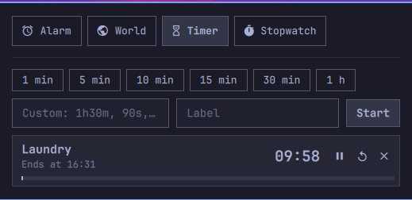

# Chime

Alarms, world clocks, timers and a stopwatch for the Omarchy bar — and they
stay in the bar while they matter. A running timer counts down next to the
clock, the stopwatch ticks there, the next alarm shows its time, and every
pinned city shows what time it is over there. When nothing is going on it
takes no room at all and only peeks out, like the bar's other hidden
indicators, when you hover the center of the bar. No daemons, no downloads,
no network: one Quickshell service inside the shell you already run, plus a
state file.



## Personal fork

This fork preserves Jean Carlos Guzman's installed modifications to
[nousd/chime](https://github.com/nousd/chime): service connections on custom
bars, balanced panel controls, and a world-clock search field that does not
clip its text. The original MIT license and plugin ID are retained.

## Install

```sh
omarchy plugin add https://github.com/jeancarlosg93/chime.git --enable
omarchy-shell chime layout split
```

The second line makes it behave exactly like one of the bar's hidden
indicators: the idle icon joins the hidden group left of the active
indicators, and whatever is running shows up on their right, next to the
date. (It does this with two bar entries around `omarchy.indicators`;
`layout merge` puts it back to one entry.) Skip it and the widget lives in
one place, wherever you put it with `omarchy bar move`.

## Use

Hover the center of the bar and click the clock icon to open the panel (or
bind a key, below). It has four tabs.

| Tab | What it does | In the bar |
|---|---|---|
| **Alarm** | Time, optional label, repeat days. One-shot alarms switch themselves off after ringing. | The next alarm's time (`󰀠 07:30`, `󰀠 Mon 07:30` when it is not today, `󰚎` while snoozed) |
| **World** | Search a city, country or zone name; pin the ones you want in the bar; rename them. | `󰇧 New York 08:45   Tokyo 21:45` |
| **Timer** | Presets 1, 5, 10, 15, 30 min and 1 h, or type `1h30m`, `90s`, `12:30`. Several can run at once. | Each running timer counting down (`󰔟 04:59`, `󰏤` while paused) |
| **Stopwatch** | Start, pause, lap, reset, to a tenth of a second. | `󱎫 01:23` |

When an alarm or timer goes off, a card comes up on every screen over
whatever you are doing, the system alarm sound loops, and the bar readout
turns red. **Enter**, **Escape** or **Stop** end it; **S** or the other
button snoozes an alarm (9 minutes by default) or gives a timer five more
minutes. An alarm nobody answers stops after five minutes and snoozes
itself, up to three times.

Bar icon: left click opens the panel, right click pauses or resumes
whatever is counting, middle click starts a quick timer (5 minutes by
default). While something rings, any click stops it.

In the panel: `← →` or `1`–`4` change tab, `↑ ↓` pick a row, `Enter` acts
on it (alarm on/off, pin a city, pause or resume a timer), `x` removes it,
`n` starts something new (a new alarm, the city search, the custom timer
field), `Esc` closes. On the stopwatch tab `Space` starts and pauses,
`Enter` laps, `r` resets a paused stopwatch.

## Configure

```sh
omarchy bar set io.github.nousd.chime alwaysShow true --json        # keep the icon visible while idle
omarchy bar set io.github.nousd.chime showNextAlarm false --json    # keep alarms out of the bar
omarchy bar set io.github.nousd.chime hour12 true --json            # 7:30 PM instead of 19:30
omarchy bar set io.github.nousd.chime quickTimerMinutes 10          # middle-click timer length
omarchy bar set io.github.nousd.chime snoozeMinutes 5
omarchy bar set io.github.nousd.chime ringSeconds 120               # how long a ring lasts unanswered
omarchy bar set io.github.nousd.chime mute true --json              # screen only, no sound
omarchy bar set io.github.nousd.chime sound ~/Music/bell.ogg        # any file pw-play, paplay, mpv or ffplay can play
omarchy bar move io.github.nousd.chime --section right
```

With a split layout the settings on the first of the two bar entries are
the ones that count, and that is the entry `omarchy bar set` writes.

A keybinding for the panel, in `~/.config/hypr/bindings.lua`:

```lua
o.bind("SUPER + ALT + C", "Chime", "omarchy-shell -q shell toggle io.github.nousd.chime")
```

## Scripting

`omarchy-shell chime <verb>`. Every argument is required (the shell's
IPC has no optional ones), so pass `""` for a label or day list you do not
want.

| Verb | |
|---|---|
| `timer <duration> <label>` | Start a timer: `timer 5 ""`, `timer 90s Eggs`, `1h30m`, `12:30`. Prints its id. |
| `pauseTimer <id>` · `resumeTimer <id>` · `toggleTimer <id>` · `resetTimer <id>` · `cancelTimer <id>` · `cancelTimers` | |
| `stopwatch start\|pause\|toggle\|lap\|reset` | |
| `alarm <time> <label> <days>` | `alarm 07:30 "Wake up" 1,2,3,4,5` — days are `0`–`6`, Sunday is `0`, `""` means once. Prints its id. |
| `enableAlarm <id>` · `disableAlarm <id>` · `toggleAlarm <id>` · `removeAlarm <id>` | |
| `addClock <zone>` · `removeClock <zone>` · `pinClock <zone> true\|false` | Zone names as in `timedatectl list-timezones`. |
| `stop` · `snooze` | End or snooze whatever is ringing. |
| `toggleRunning` | What the bar icon's right click does. |
| `layout split\|merge\|status` | Two bar entries around the indicators, or back to one. |
| `status` | Everything, as JSON. |
| `open` · `hide` · `toggle` | The panel. |

## How it works

Everything is stored as instants, not counters: a timer is its end time, the
stopwatch is when it last started plus what it had banked, an alarm is a time
of day plus the occurrence it last rang for. So a shell restart or a laptop
lid does not stretch anything — the service just asks "is something due?"
when it wakes. Anything that came due more than ten minutes ago is reported
as a missed alarm or timer through a notification instead of ringing late.

World-clock times come from `date` under `TZ=`, refreshed every half hour
and whenever the list changes, because the shell's JavaScript engine has no
time-zone support of its own. The city list is tzdata's own
`zone1970.tab`, read when the World tab first opens.

State lives in `~/.local/state/chime/state.json` (or under
`$XDG_STATE_HOME`), written atomically a beat after every change. Labels
are stripped to bounded plain text before they reach the bar, the ring
card, or a notification. The plugin touches nothing else: no config files,
no services, no privileges. The ring sound is the freedesktop alarm sound
played with `pw-play` (or `paplay`, `mpv`, `ffplay`, whichever exists); it
does not change your volume.

## Remove

```sh
~/.config/omarchy/plugins/io.github.nousd.chime/uninstall.sh
```

Removes the plugin and its state file. Pass `--keep-state` to keep your
alarms and cities for a later reinstall.

## Develop

```sh
scripts/dev-sync.sh --restart   # copy the checkout into the plugin dir, restart the shell
scripts/lint.sh                 # manifest, qmllint, model tests
```

The shell hot-reloads QML on save but keeps a cached `Model.js`; restart
the shell before judging a change to it.

MIT — see [LICENSE](LICENSE).
